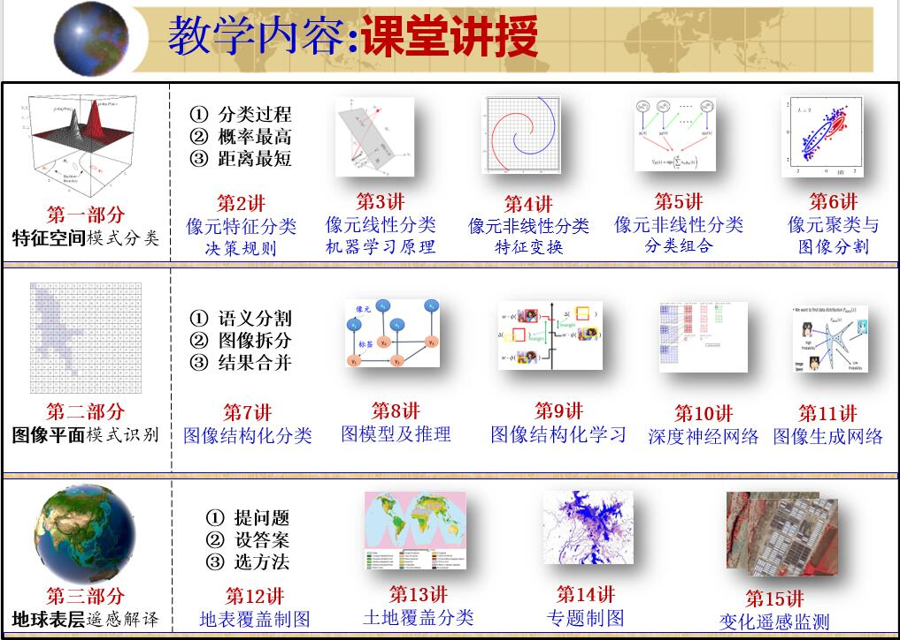

.. PRoRS documentation master file, created by
   sphinx-quickstart on Thu Aug 10 16:32:29 2017.
   You can adapt this file completely to your liking, but it should at least
   contain the root `toctree` directive.

Pattern Recognition of Remote Sensing
=======================================

欢迎来到遥感图像模式识别课程主页

.. toctree::
    :maxdepth: 1
    :caption: 课程介绍

    Introduction/1.Introduction/index

.. toctree::
    :maxdepth: 1
    :caption: 第一部分:特征空间模式分类

    1stPart/Chapter2.PattenFeatureRecognition/index
    1stPart/Chapter3.LinearDiscriminantFunction/index
    1stPart/Chapter4.NonLinearClassification/index
    1stPart/Chapter5.EnsembleClassification/index
    1stPart/Chapter6.ImageClustering/index

.. toctree::
    :maxdepth: 1
    :caption: 第二部分:图像平面模式识别

    2ndPart/Chapter7.ImageClassification/index
    2ndPart/Chapter8.SceneClassification/index
    2ndPart/Chapter9.ObjectClassification/index
    2ndPart/Chapter10.Segmentation/index

.. toctree::
    :maxdepth: 1
    :caption: 第三部分:地球表面遥感制图

    3rdPart/Chapter11.RSinterpretation/index
    3rdPart/Chapter12.LandCover/index
    3rdPart/Chapter13.ThematicMap/index
    3rdPart/Chapter14.ChangeDetection/index

.. toctree::
    :maxdepth: 1
    :caption: 学生报告

    StudentReports/2017Student/index
    StudentReports/2018Student/index

搜索
==================

* :ref:`search`
